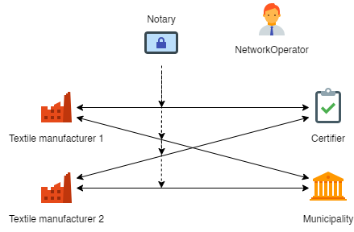

### textile-sym-dlt: Textile Symbiosis Digital Ledger Technology
Digital Ledger Technology with R3 Corda to foster Industrial Symbiosis in textile manufacturing districts



### Usage

#### Running the CorDapp

Open a terminal and go to the project root directory and type: (to deploy the nodes using bootstrapper)
```
./gradlew clean build deployNodes
```
Then type: (to run the nodes)
```
./build/nodes/runnodes
```
#### Interacting with the CorDapp

**Step 1:** Create the network in NetworkOperator's terminal
```
flow start CreateNetwork
```
Sample output:
```
Mon Apr 12 10:35:47 EDT 2021>>> flow start CreateNetwork
[...]
Flow completed with result: 
A network was created with NetworkID: <xxxx-xxxx-NETWORK-ID-xxxxx>  <- This is what you need in Step 2
```
**Step 2:** 2 non-member makes the request to join the network. Fill in the networkId with what was return from Step1
```
flow start RequestMembership authorisedParty: NetworkOperator, networkId: <xxxx-xxxx-NETWORK-ID-xxxxx>
```
**Step 3:** go back to the admin node, and query all the membership requests.
```
flow start QueryAllMembers
```
**Step 4:** In this step, Network Operator will activate the pending memberships
Textile manufacturing firm: fill in the node MembershipId that is display in the previous query for each firm
```
flow start ActivateMember membershipId: <xxxx-xxxx-TEXTILEFIRM-ID-xxxxx>
```
Certifier: fill in the MembershipId that is display in the previous query
```
flow start ActivateMember membershipId: <xxxx-xxxx-CERTIFIER-ID-xxxxx>
```
Municipality: fill in the MembershipId that is display in the previous query
```
flow start ActivateMember membershipId: <xxxx-xxxx-MUNICIPALITY-ID-xxxxx>
```

**Step 5:** Admin create subgroup and add group members.
```
flow start CreateNetworkSubGroup networkId: <xxxx-FROM-STEP-ONE-xxxxx>, groupName: Prato_Textile_District, groupParticipants: [<xxxx-NETWORKOPERATOR-ID-xxxxx>, <xxxx-xxxx-TEXTILEFIRM-ID-xxxxx>, <xxxx-xxxx-CERTIFIER-ID-xxxxx>, <xxxx-xxxx-MUNICIPALITY-ID-xxxxx>]
```
**Step 6:** Admin assign business identity to a member.
```
flow start AssignBNIdentity firmType: TextileFirm, membershipId: <xxxx-xxxx-TEXTILEFIRM-ID-xxxxx>, bnIdentity: PRATOT76CZX
```
**Step 7:** Admin assign business identity to the second member
```
flow start AssignBNIdentity firmType: Certifier, membershipId: <xxxx-xxxx-CERTIFIER-ID-xxxxx>, bnIdentity: PRATOC44OJS
```
**Step 8:** Admin assign business identity to the third member
```
flow start AssignBNIdentity firmType: Municipality, membershipId: <xxxx-xxxx-MUNICIPALITY-ID-xxxxx>, bnIdentity: PRATOM35OJS
```
**Step 9:** Admin assign business identity related ROLE to the member.
```
flow start AssignTextileDataSharingRole membershipId: <xxxx-xxxx-TEXTILEFIRM-ID-xxxxx>, networkId: <xxxx-xxxx-NETWORK-ID-xxxxx>
```
Now to see our membership states, we can run these vault queries.
```
run vaultQuery contractStateType: net.corda.core.contracts.ContractState
run vaultQuery contractStateType: net.corda.bn.states.MembershipState
```
-------------------Network setup is done, and business flow begins--------------------------

**Step 10:** A textile firm will share data to the certifier. The flow initiator (the textile manufacturer) has to be a member of the Business network, has to have a TextileFirmIdentity, the permission to share data.
[<JSON-FROM-LINK>](/java/it/polimi/tgolfetto/TEXTILE_DATA_MOCK.json)
```
flow start SendTextileDataInitiator networkId: <xxxx-xxxx-NETWORK-ID-xxxxx>, receiver: Certifier, jsonData: <JSON-FROM-LINK>
```
**Step 11:** Query the state from the Certifier node.
```
run vaultQuery contractStateType: it.polimi.tgolfetto.states.TextileDataState
```
