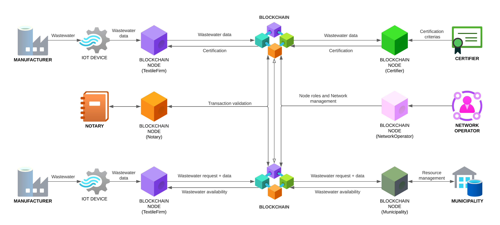

### TexSymDLT: Digital Ledger Technology for Textile Wastewater Industrial Symbiosis
Digital Ledger Technology with R3 Corda to foster Industrial Symbiosis in textile manufacturing districts



### TODO:
- finish to write and publish related thesis paper
- test with terminal the big json data flows
- write contract and state tests

### Usage

#### Running the CorDapp

Open a terminal and go to the project root directory and type: (to deploy the nodes using bootstrapper)
```
./gradlew clean build deployNodes
```
Then type: (to run the nodes)
```
./build/nodes/runnodes
```
#### Interacting with the CorDapp

**Step 1:** Create the network in NetworkOperator's terminal
```
flow start CreateNetwork
```
Sample output:
```
Wed Apr 12 10:35:47 EDT 2023>>> flow start CreateNetwork
[...]
Flow completed with result: 
A network was created with NetworkID: <xxxx-xxxx-NETWORK-ID-xxxxx>  <- This is what you need in Step 2
```
**Step 2:** 2 non-member makes the request to join the network. Fill in the networkId with what was return from Step1
```
flow start RequestMembership authorisedParty: NetworkOperator, networkId: <xxxx-xxxx-NETWORK-ID-xxxxx>
```
**Step 3:** go back to the admin node, and query all the membership requests.
```
flow start QueryAllMembers
```
**Step 4:** In this step, Network Operator will activate the pending memberships
Textile manufacturing firm: fill in the node MembershipId that is display in the previous query for each firm
```
flow start ActivateMember membershipId: <xxxx-xxxx-TEXTILEFIRM-ID-xxxxx>
```
Certifier: fill in the MembershipId that is display in the previous query
```
flow start ActivateMember membershipId: <xxxx-xxxx-CERTIFIER-ID-xxxxx>
```
Municipality: fill in the MembershipId that is display in the previous query
```
flow start ActivateMember membershipId: <xxxx-xxxx-MUNICIPALITY-ID-xxxxx>
```

**Step 5:** Admin create subgroup and add group members.
```
flow start CreateNetworkSubGroup networkId: <xxxx-FROM-STEP-ONE-xxxxx>, groupName: Prato_Textile_District, groupParticipants: [<xxxx-NETWORKOPERATOR-ID-xxxxx>, <xxxx-xxxx-TEXTILEFIRM-ID-xxxxx>, <xxxx-xxxx-CERTIFIER-ID-xxxxx>, <xxxx-xxxx-MUNICIPALITY-ID-xxxxx>]
```
**Step 6:** Admin assign business identity to a member.
```
flow start AssignBNIdentity firmType: TextileFirm, membershipId: <xxxx-xxxx-TEXTILEFIRM-ID-xxxxx>, bnIdentity: PRATOT76CZX
```
**Step 7:** Admin assign business identity to the second member
```
flow start AssignBNIdentity firmType: Certifier, membershipId: <xxxx-xxxx-CERTIFIER-ID-xxxxx>, bnIdentity: PRATOC44OJS
```
**Step 8:** Admin assign business identity to the third member
```
flow start AssignBNIdentity firmType: Municipality, membershipId: <xxxx-xxxx-MUNICIPALITY-ID-xxxxx>, bnIdentity: PRATOM35OJS
```
**Step 9:** Admin assign business identity related ROLE to the member.
```
flow start AssignTextileDataSharingRole membershipId: <xxxx-xxxx-TEXTILEFIRM-ID-xxxxx>, networkId: <xxxx-xxxx-NETWORK-ID-xxxxx>
```
Now to see our membership states, we can run these vault queries.
```
run vaultQuery contractStateType: net.corda.core.contracts.ContractState
run vaultQuery contractStateType: net.corda.bn.states.MembershipState
```
-------------------Network setup is done, and business flow begins--------------------------

**Step 10:** A textile firm will share data to the certifier. The flow initiator (the textile manufacturer) has to be a member of the Business network, has to have a TextileFirmIdentity, the permission to share data.

[JSON-TEXTILE-DATA](https://github.com/tgolfetto/textile-sym-dlt/blob/main/workflows/src/test/java/it/polimi/tgolfetto/TEXTILE_DATA_MOCK.json) contains a mock json with the structure to share textile pollution data retrieved with sensors along the production process
```
flow start SendTextileDataInitiator networkId: <xxxx-xxxx-NETWORK-ID-xxxxx>, senderId: <xxxx-xxxx-TEXTILEFIRM-ID-xxxxx>, receiver: <xxxx-xxxx-CERTIFIER-ID-xxxxx>, jsonData: <JSON-TEXTILE-DATA>
```
**Step 11:** Query the state from the Certifier node.
```
run vaultQuery contractStateType: it.polimi.tgolfetto.states.TextileDataState
```
**Step 12:** Certifier realease a checks criteria for a textile firm data and eventually release a certification

[JSON-CERT-CRITERIA](https://github.com/tgolfetto/textile-sym-dlt/blob/main/workflows/src/test/java/it/polimi/tgolfetto/CERTIFICATION_CRITERIA_MOCK.json) contains a mock json with the structure with limits related to the pollution data for getting a certification
```
flow start SendCertificationInitiator networkId: <xxxx-xxxx-NETWORK-ID-xxxxx>, senderId: <xxxx-xxxx-CERTIFIER-ID-xxxxx>, receiver: <xxxx-xxxx-TEXTILEFIRM-ID-xxxxx>, criteria: <JSON-CERT-CRITERIA>
```

**Step 13:** Textile firm can send waste material request (sending or wishing to receive) to Municipality

- send: true --> A firm is willing to share the waste material with a certain pollution data
- send: false --> A firm wish to receive the waste material 

```
flow start SendWasteRequestInitiator networkId: <xxxx-xxxx-NETWORK-ID-xxxxx>, senderId: <xxxx-xxxx-TEXTILEFIRM-ID-xxxxx>, receiver: <xxxx-xxxx-MUNICIPALITY-ID-xxxxx>, send: true, qty: 100, wasteName: water, wasteWaterData: <JSON-TEXTILE-DATA>
```

**Step 14:** Municipality can communicate to a textile firm which other firms in the network can provide the waste material the need to receive with the related pollution data

```
flow start SendWasteResponseInitiator networkId: <xxxx-xxxx-NETWORK-ID-xxxxx>, senderId: <xxxx-xxxx-TEXTILEFIRM-ID-xxxxx>, receiver: <xxxx-xxxx-MUNICIPALITY-ID-xxxxx>, send: true, qty: 100, wasteName: water, wasteWaterData: <JSON-TEXTILE-DATA>
```
**Step 15:** Query the states from nodes

It's possible to query the following states in order to retrieve all the information exchanged with the previous flows, query has to be performed on the node containing it as for R3 Corda documentation:
- CertificationState
- WasteWaterDataState
- WasteRequestState
- WasteResponseState
```
run vaultQuery contractStateType: it.polimi.tgolfetto.states.WasteResponseState
```
